# ZSL video classification/action recognition

## 2020. CVPR. Rethinking Zero-shot Video Classification: End-to-end Training for Realistic Applications

**Keywords**：*end-to-end*,  *3D CNN*, *extend the current benchmarking*,  *encourage domain shift*

**Contribution**：

1. 用简单的网络实现一个e2e的网络，并设计了简单的与训练技术
2. D提出了一种新的ZSL训练和评估协议（测试集和训练集是不相交，完全脱节的）

以往方法：先训好CNN，提出fs函数（将feature转换为embedding），固定CNN训练fs

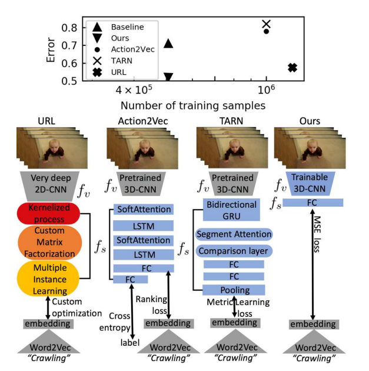

本方法：不固定CNN，因为CNN本身就是一个复杂网络，其中含有fs的能力，所以仅需要一个fc即可

测试了以往的方法在真实的ZSL设定下的效果：

1. **Non-overlapping training and test classes:**  数据集中seen和unseen可能有不一样的类名，相似的概念
   计算类和类attribute之间的cosine距离，去除与unseen类别相似的seen类别
2. **Different training and test video domains:**  使用多个数据集
3. **Multiple test datasets**  

提出简单的预训练方法：

data augmentation：使用静态图片组成视频序列进行预训练

## 2019. CVPR. Out-of-Distribution Detection for Generalized Zero-Shot Action Recognition（GAN）

**Keywords：** *inherent bias*，*out-of-distribution detector*， *generative adversarial networks*

**Contribution：**

1. 设计了OD detector（区分seen和unseen类别），减轻了以往action recognition中seen类别的inherent bias（意思就是在GZSL任务中最后往往是一个分类器，容易把unseen分类到seen类别上）影响
2. 使用GAN完成OD detector的训练（简单的二元分类无法完成要求，故将seen和unseen类别的features转换到熵空间，使seen类别feature有一个不均匀的输出，而unseen类别的feature有一个平缓均匀的输出，测试时，如果test的feature的熵输出小于一个阈值，就是seen类别的（熵越大越稳定，越小越不均匀），反之就是unseen类别的）

三个分类器：$f_{OD}, f_s, f_u$，$f_{OD}$先检测是seen还是unseen类别，再分配到$f_s, f_u$处完成检测

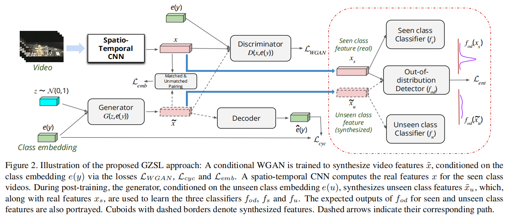

## 2019. AAAI. I Know the Relationships: Zero-Shot Action Recognition via Two-Stream Graph Convolutional Networks and Knowledge Graphs

## 2020. TPAMI. Learning to Model Relationships for Zero-Shot Video Classification

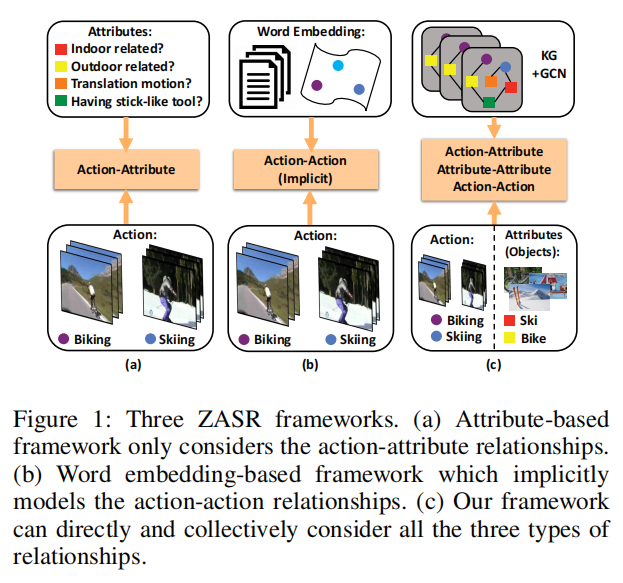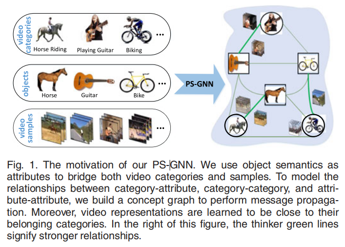

首先他用video中出现的一些物体（object）来作为attribute，如滑雪中出现的雪山、滑板等。通过构建action和object的knowledge graph，以及video和object的knowledge graph来建模三种关系：action-attribute、attribute-attribute、action-action。

**3D无背景，也用不到object和背景的关系**

## 2019. ICCV. Zero-Shot Anticipation for Instructional Activities

利用文本+视频预测接下来发生的动作，提出菜谱数据集，利用文本描述的做菜步骤信息来辅助预测。

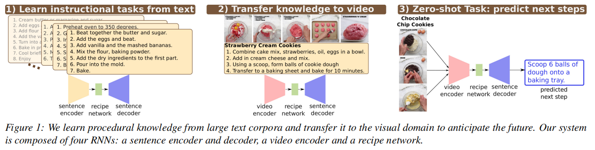

## 2018. Visual Data Synthesis via GAN for Zero-Shot Video Classification

**Keywords：** *multi-level semantic* *inference*，*Matching-aware Mutual Information Correlation*，

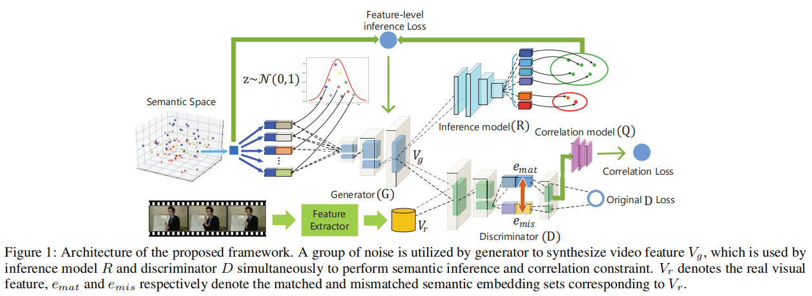

1. attribute加上一堆z之后生成一堆features Vg，通过R返回生成semantic embedding，计算loss，cosine距离
2. 提出D应该判断是否与conditional information均衡，而不是只看真实性（D没有明确的概念说feature是否和embedding匹配），计算correlation loss（feature和match embedding、mismatch embedding的loss)
3. 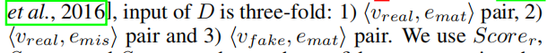在D中加入feature与embedding之间match的分数

GAN的原始缺失不足以使G能够合成判别的视觉特征数据，因为D没有关于视觉特征是否与语义嵌入相匹配的明确概念。

## 2021. WACV. AVGZSLNet: Audio-Visual Generalized Zero-Shot Learning by Reconstructing Label Features from Multi-Modal Embeddings

 Audio-Visual Generalized Zero-Shot Learning

结合视频和音频的学习方法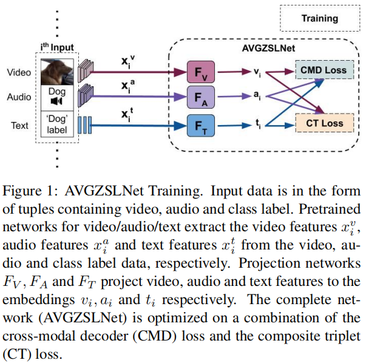

## 2017. ICCV. Spatial-Aware Object Embeddings for Zero-Shot Localization and Classification of Actions

***Keywords：** zero-shot localization and classification*， *spatial-aware object embedding*

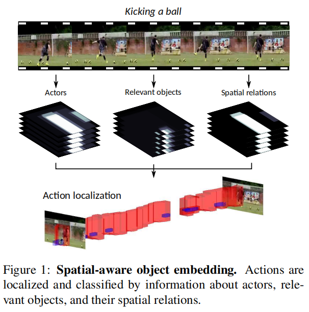

一个action包含actor和objects,以及两者之间的关系。关系则主要指两者之间的位置关系。

localization：将独立帧连接为移动的cube

1）首先对每帧图像而言，抽取出图像离的actor和object。方法很简单，直接用在COCO上训练过的faster-rcnn。可以检测出80-1种object(1是人/pedestrian)。我们可以拿到每一个BBox的confidence score，结合semantic relation可以用余弦距离来计算action-object的score。

2）第二步，则是形成spatial-aware, global aware的score，并给所有帧都打分。

3）第三步就是讲上面步骤的结果连在一起。

## 2019. **Action2Vec: A Crossmodal Embedding Approach to Action Learning**

knowledge transfer方法，将feature转换到embedding空间

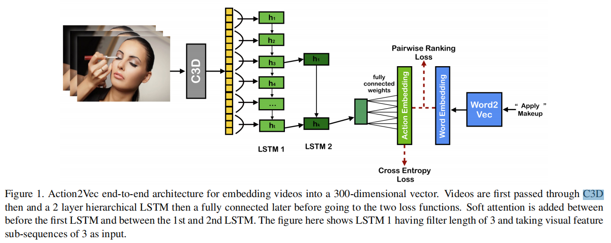

LSTM1和LSTM2之间加入了soft attention模块，加重视频帧之间的时间关系

## 2018. CVPR. Towards Universal Representation for Unseen Action Recognition

**Keywords：** *Unseen Action Recognition*，*Generalized Multiple-Instance Learning (GMIL)*

本文提出了一种使用大规模训练源的pipeline来实现*Universal Representation*(UR)，它可以推广到更现实的跨数据集场景。

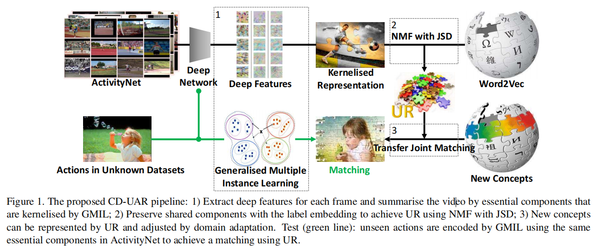

1. GMIL：GMIL旨在发现那些基本的“构建块”来表示源域和目标域中的actions，并抑制模糊的实例。
2. UR：通用表示学习（生成embedding的方法）

GMIL把每个类分成H个包（使用K-means聚类），借助odds ratio（优势比，表示这个包/属性对分类的贡献）

个人理解：在大数据集上训练，把每个类分成H个包，从而获得C×H个包，然后建立feature中的包（比如脚、手）与attribute的对应关系，保存在公共空间，有一个新图片时，将生成的feature归类为一些包，同时将新的类别从UR中获得attribute，再根据距离进行matching获得最后的分类结果

